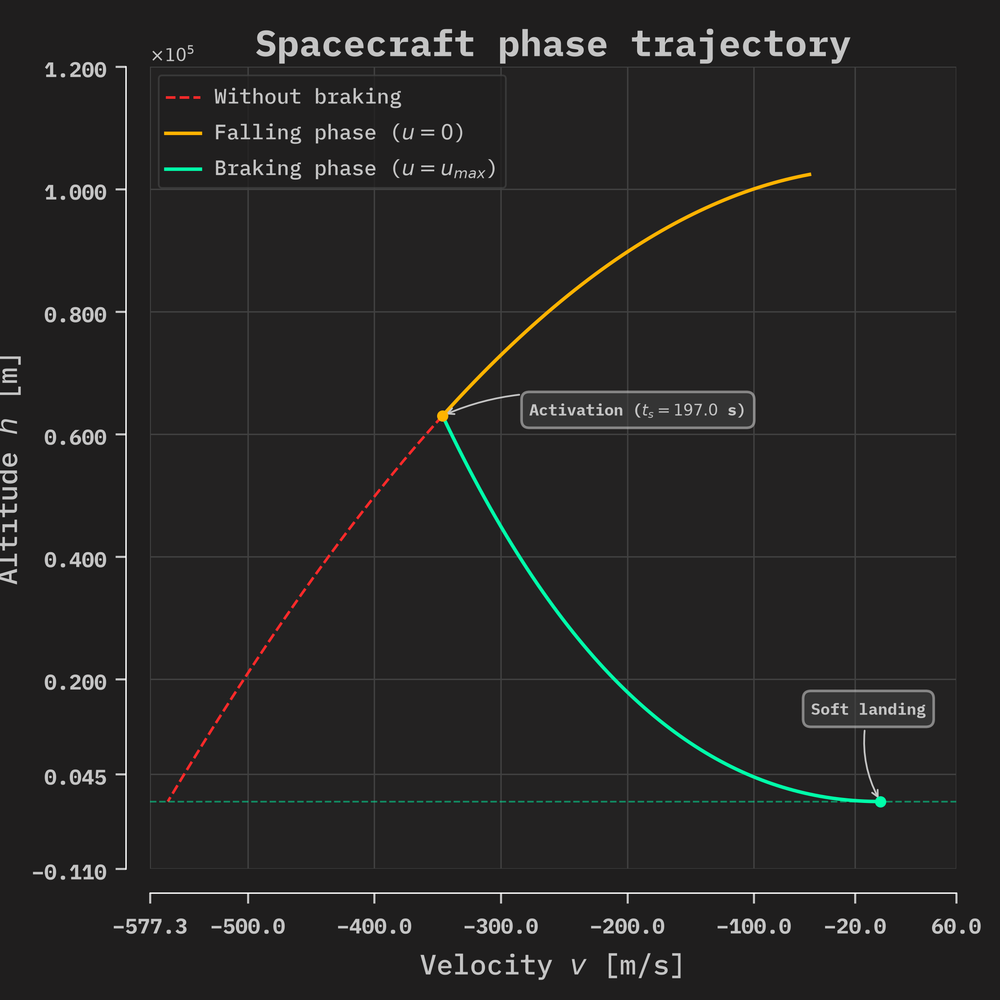
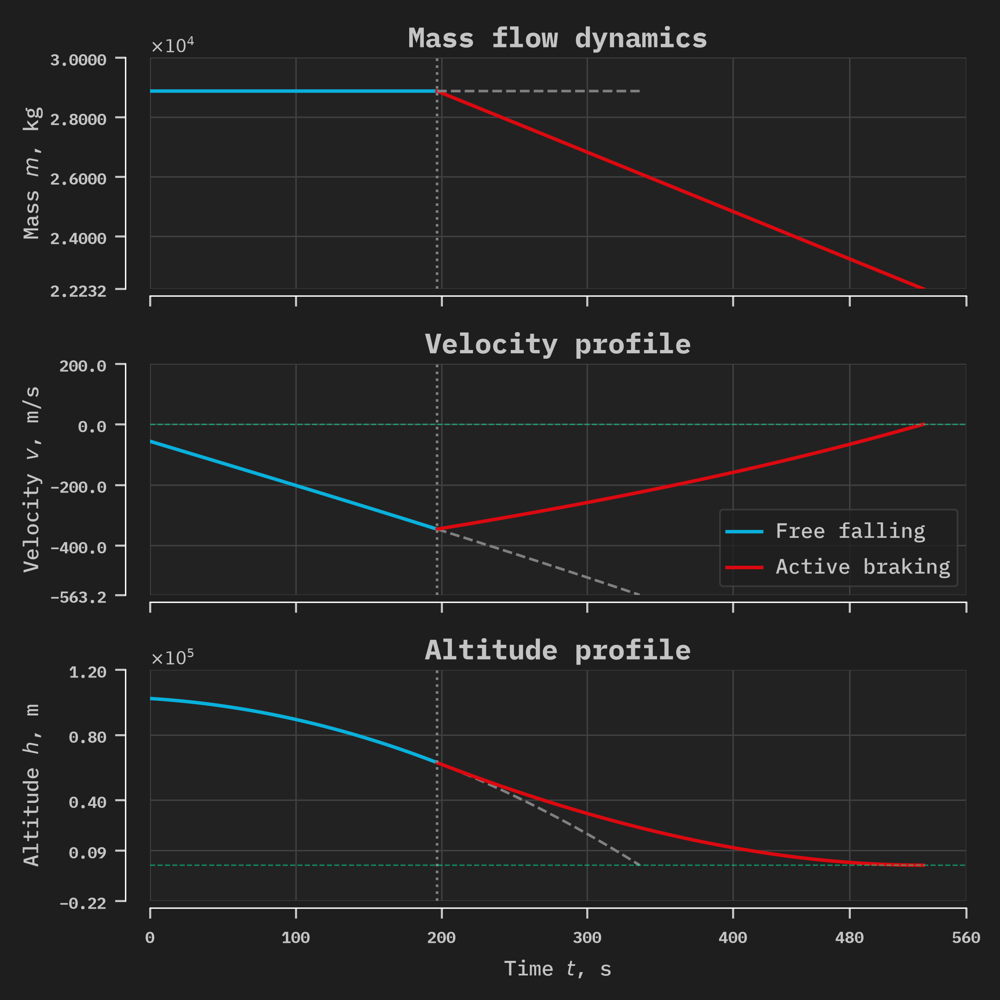
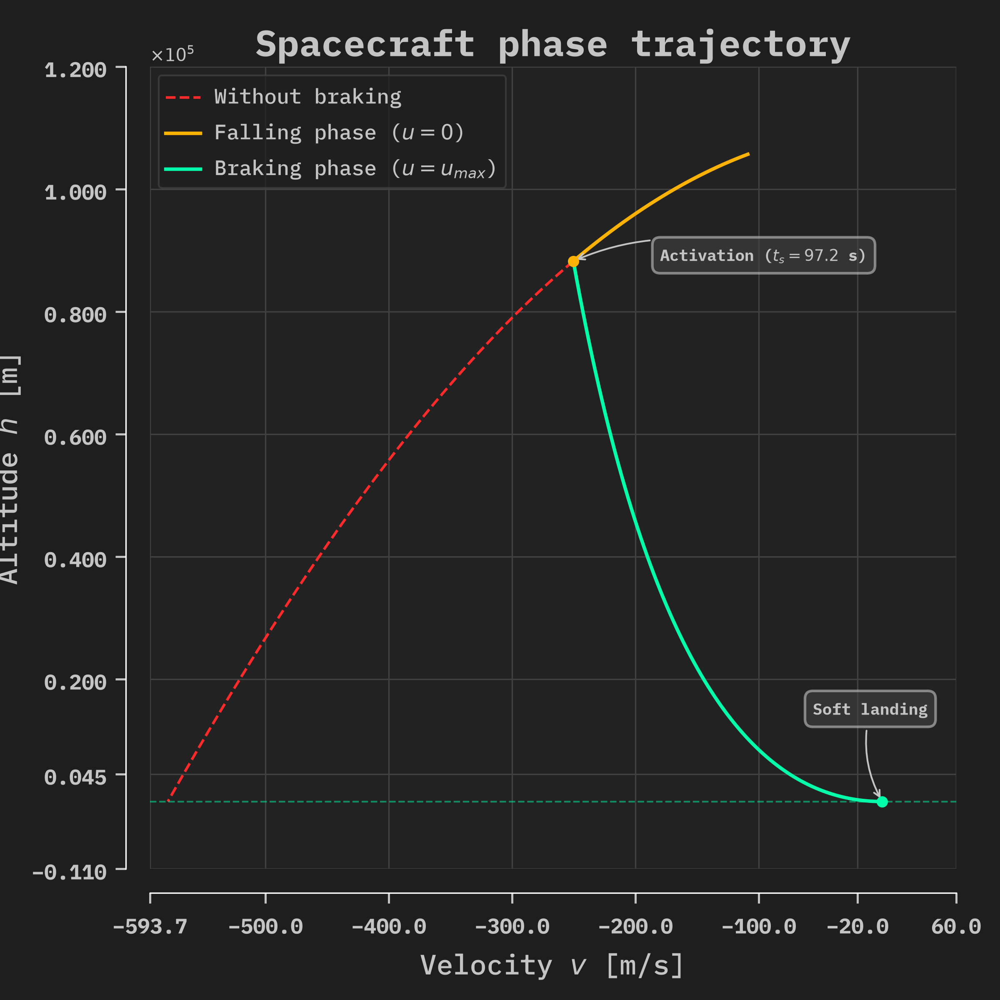
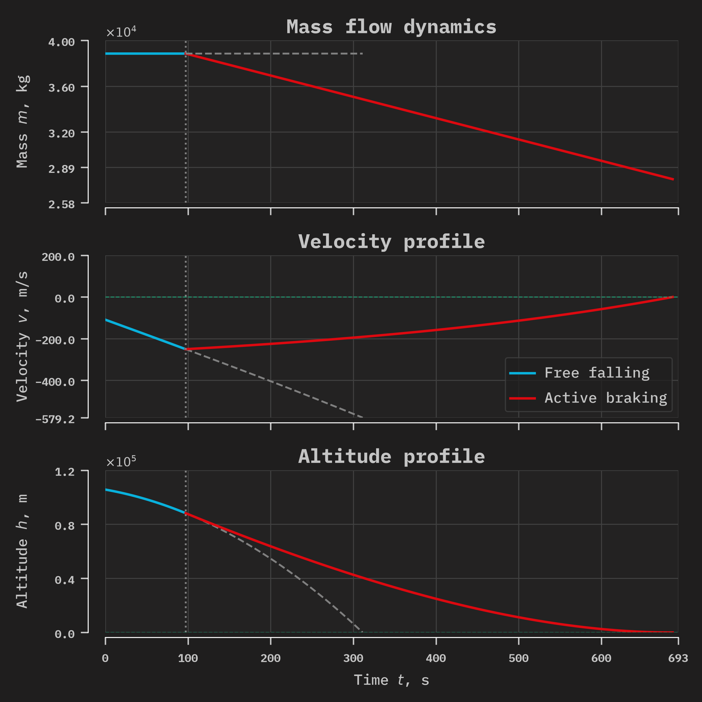
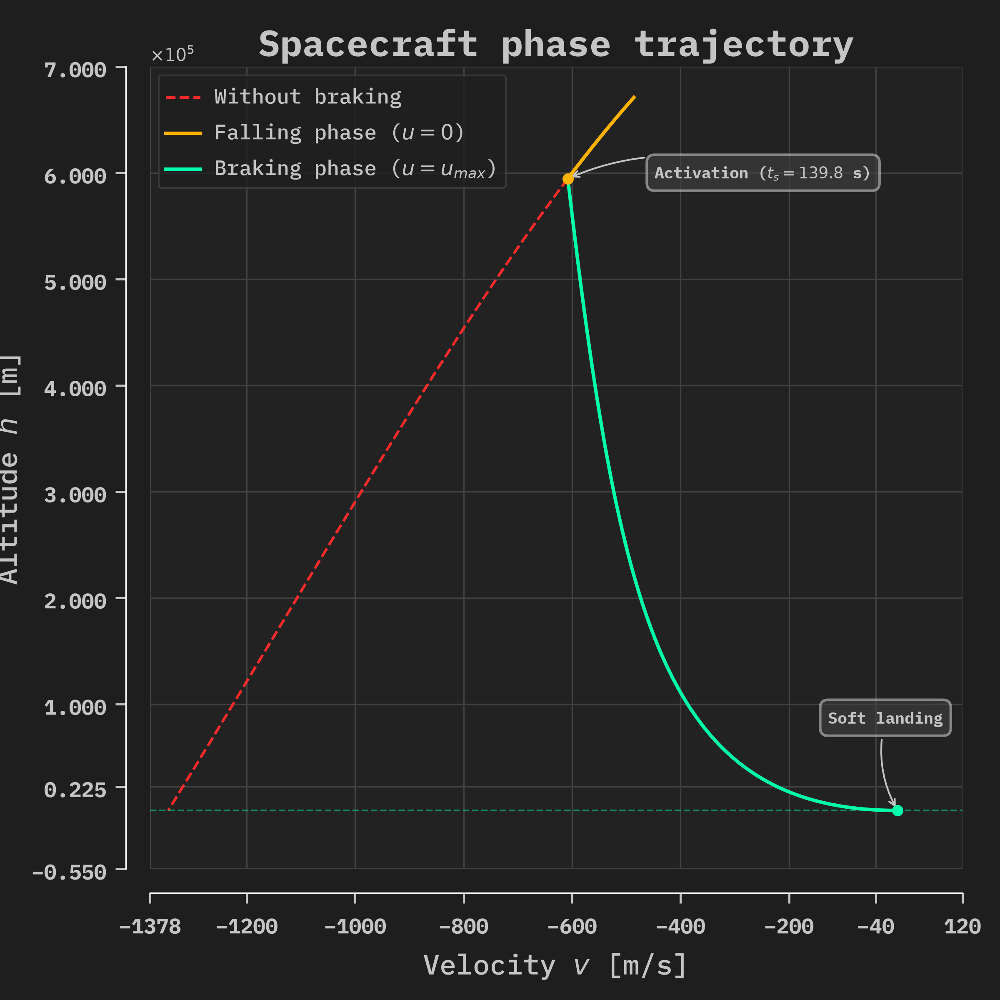
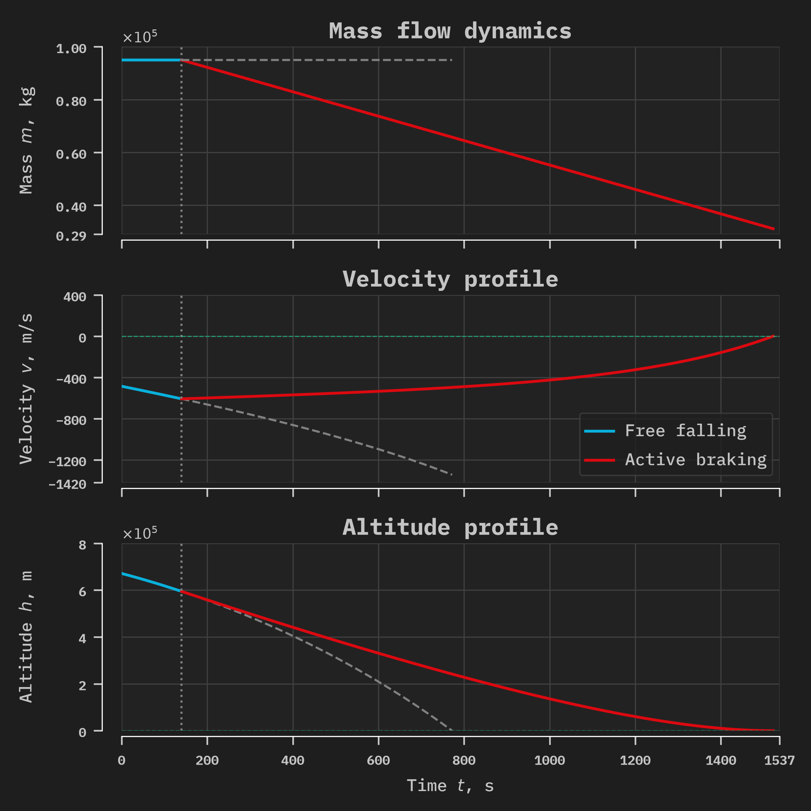
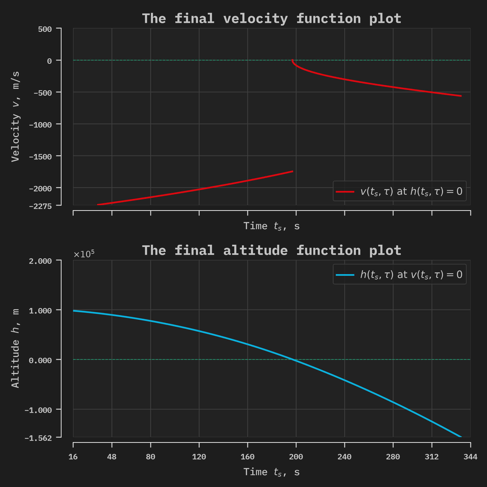
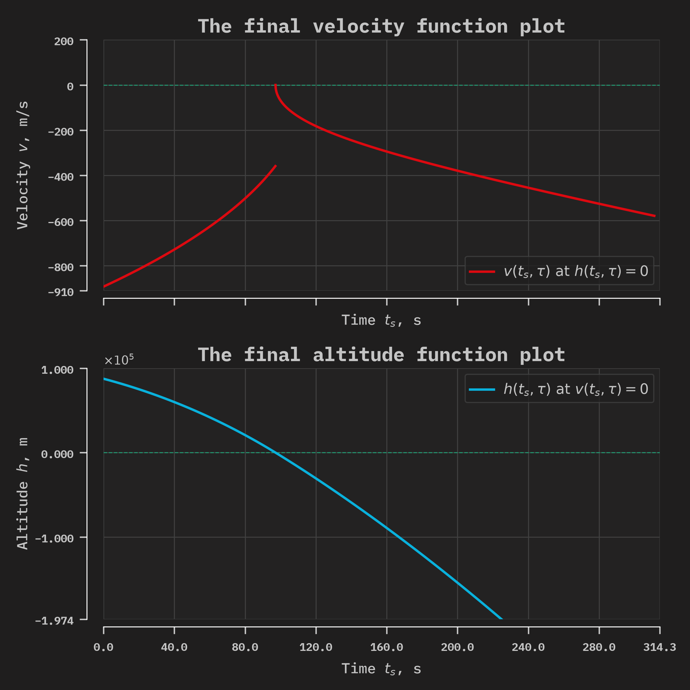
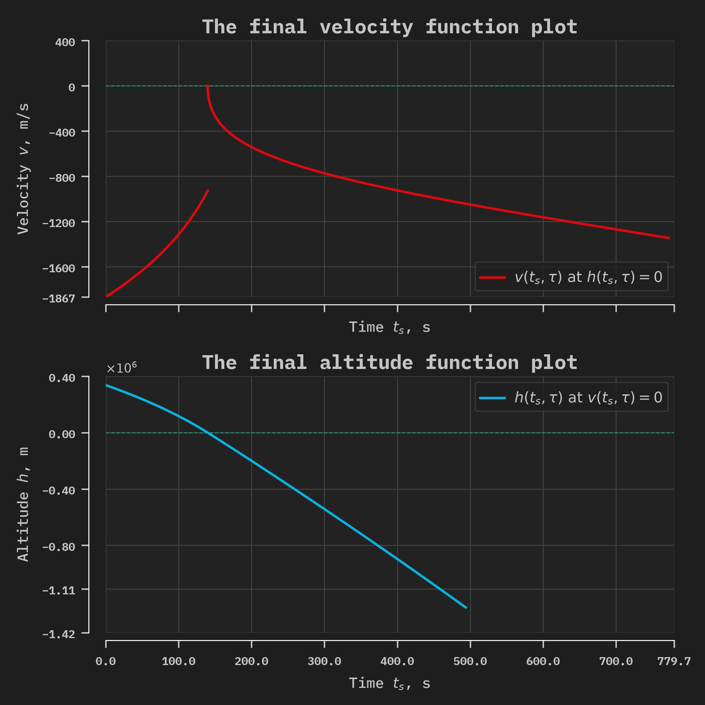

# 📊 Examples of PyAstroPDL Work

## 🚀 Program Output, Plots, and Animations
---

The following solver settings were used to find the solutions:
```python
solver = pdl.Solver(init_cond, end_cond, rocket_params, sim_engine='dynamic_g')
solver.solve(dt=0.01)
solver.find_residuals(dt=0.1)
```

---
### 🔹 Example 1. Standard LLO Descent (TWR ~1.42)

The following system parameters are considered:
```Python
# === Condition of BVP ===

init_cond = [28877, -56, 102378]  # [m_0, v_0, h_0] 

end_cond = [0, 0]                 # [v_tau, h_tau]

# === Rocket Parameters ===     
rocket_params = (66628, 0.00029903701260349804, 17644)  # (u_max, k, m_fuel)

```

#### 📋 Summary of the solution:
```Bash
[ EXECUTING ]: Standard LLO Descent (TWR ~1.42)
[ SUCCESS ]: Solved in 0.0671 seconds.

    =========================================================================
                        LUNAR SOFT LANDING RESULTS                  
    =========================================================================
    Parameter          |  Engine Switching (t_s)  |  Terminal Landing (tau)
    -------------------------------------------------------------------------
    Time (s)           |                  196.98  |                  530.47
    Altitude (m)       |                62986.95  |                   -0.00
    Velocity (m/s)     |                 -346.04  |                    0.00
    Vehicle Mass (kg)  |                28877.00  |                22232.42
    =========================================================================
```

#### 📈 Visualizations (Phase Trajectory & Telemetry)





#### 🎬 Trajectory Animation

[🔗 Watch Animation (MP4)](assets/video/ani_standard_llo_descent.mp4)

---

### 🔹 Example 2. Heavy Cargo Landing (TWR ~1.04, Critical Mass)

The following system parameters are considered:

```Python
# === Condition of BVP ===

init_cond = [38852, -109, 105674]  # [m_0, v_0, h_0] 

end_cond = [0, 0]                 # [v_tau, h_tau]

# === Rocket Parameters ===     
rocket_params = (65848, 0.0002832545036049801, 15358)  # (u_max, k, m_fuel)

```

#### 📋 Summary of the solution:
```Bash
[ EXECUTING ]: Heavy Cargo Landing (TWR ~1.04, Critical Mass)
[ SUCCESS ]: Solved in 0.0527 seconds.

    =========================================================================
                        LUNAR SOFT LANDING RESULTS                  
    =========================================================================
    Parameter          |  Engine Switching (t_s)  |  Terminal Landing (tau)
    -------------------------------------------------------------------------
    Time (s)           |                   97.19  |                  686.17
    Altitude (m)       |                88227.94  |                   -0.00
    Velocity (m/s)     |                 -250.44  |                   -0.00
    Vehicle Mass (kg)  |                38852.00  |                27866.57
    =========================================================================
```

#### 📈 Visualizations (Phase Trajectory & Telemetry)





#### 🎬 Trajectory Animation

[🔗 Watch Animation (MP4)](assets/video/ani_heavy_cargo_low_twr.mp4)

---

### Example 3. TWR < 1 Recovery (Starship-class Mass Penalty)

The following system parameters are considered:

```Python
# === Condition of BVP ===

init_cond = [94980, -486, 670927]  # [m_0, v_0, h_0] 

end_cond = [0, 0]                 # [v_tau, h_tau]

# === Rocket Parameters ===     
rocket_params = (98819, 0.00046775973072382037, 77383)  # (u_max, k, m_fuel)

```

#### 📋 Summary of the solution:
```Bash
[ EXECUTING ]: TWR < 1 Recovery (Starship-class Mass Penalty)
[ SUCCESS ]: Solved in 0.6858 seconds.

    =========================================================================
                        LUNAR SOFT LANDING RESULTS                  
    =========================================================================
    Parameter          |  Engine Switching (t_s)  |  Terminal Landing (tau)
    -------------------------------------------------------------------------
    Time (s)           |                  139.79  |                 1521.75
    Altitude (m)       |               594559.26  |                   -0.00
    Velocity (m/s)     |                 -607.89  |                   -0.00
    Vehicle Mass (kg)  |                94980.00  |                31101.11
    =========================================================================
```

#### 📈 Visualizations (Phase Trajectory & Telemetry)






#### 🎬 Trajectory Animation

[🔗 Watch Animation (MP4)](assets/video/ani_twr_sub_1_heavy.mp4)

---

## 📉 Residual Function Plots
---


### The following solver settings were used to calculate the residual functions:
```Python
solver = pdl.Solver(init_cond, end_cond, rocket_params, sim_engine='dynamic_g')

solver.solve(dt=0.1)

solver.find_residuals(dt=0.1)
```

---

#### Example 1. Standard LLO Descent (TWR ~1.42)

The following system parameters are considered:

```Python
# === Condition of BVP ===

init_cond = [28877, -56, 102378]  # [m_0, v_0, h_0] 

end_cond = [0, 0]                 # [v_tau, h_tau]

# === Rocket Parameters ===     
rocket_params = (66628, 0.00029903701260349804, 17644)  # (u_max, k, m_fuel)

```

#### ⏱️ Calculation execution time:
```Bash
[ EXECUTING ]: Standard LLO Descent (TWR ~1.42)
[ SUCCESS ]: Find in 26.3310 seconds.
```

#### 🖼️ Residual function plot:



---

### 🔹 Example 2. Heavy Cargo Landing (TWR ~1.04, Critical Mass)

The following system parameters are considered:

```Python
# === Condition of BVP ===

init_cond = [38852, -109, 105674]  # [m_0, v_0, h_0] 

end_cond = [0, 0]                 # [v_tau, h_tau]

# === Rocket Parameters ===     
rocket_params = (65848, 0.0002832545036049801, 15358)  # (u_max, k, m_fuel)

```

#### ⏱️ Calculation execution time:
```Bash
[ EXECUTING ]: Heavy Cargo Landing (TWR ~1.04, Critical Mass)
[ SUCCESS ]: Find in 1.2360 seconds.
```

#### 🖼️ Residual function plot:



---

### 🔹 Example 3. TWR < 1 Recovery (Starship-class Mass Penalty)

The following system parameters are considered:
```Python
# === Condition of BVP ===

init_cond = [94980, -486, 670927]  # [m_0, v_0, h_0] 

end_cond = [0, 0]                 # [v_tau, h_tau]

# === Rocket Parameters ===     
rocket_params = (98819, 0.00046775973072382037, 77383)  # (u_max, k, m_fuel)

```

#### ⏱️ Calculation execution time:
```Bash
[ EXECUTING ]: TWR < 1 Recovery (Starship-class Mass Penalty)
[ SUCCESS ]: Find in 6.7182 seconds.
```

#### 🖼️ Residual function plot:



---