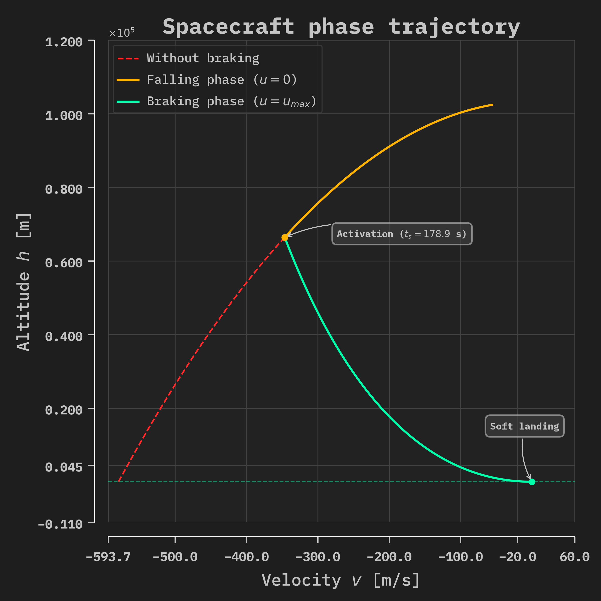
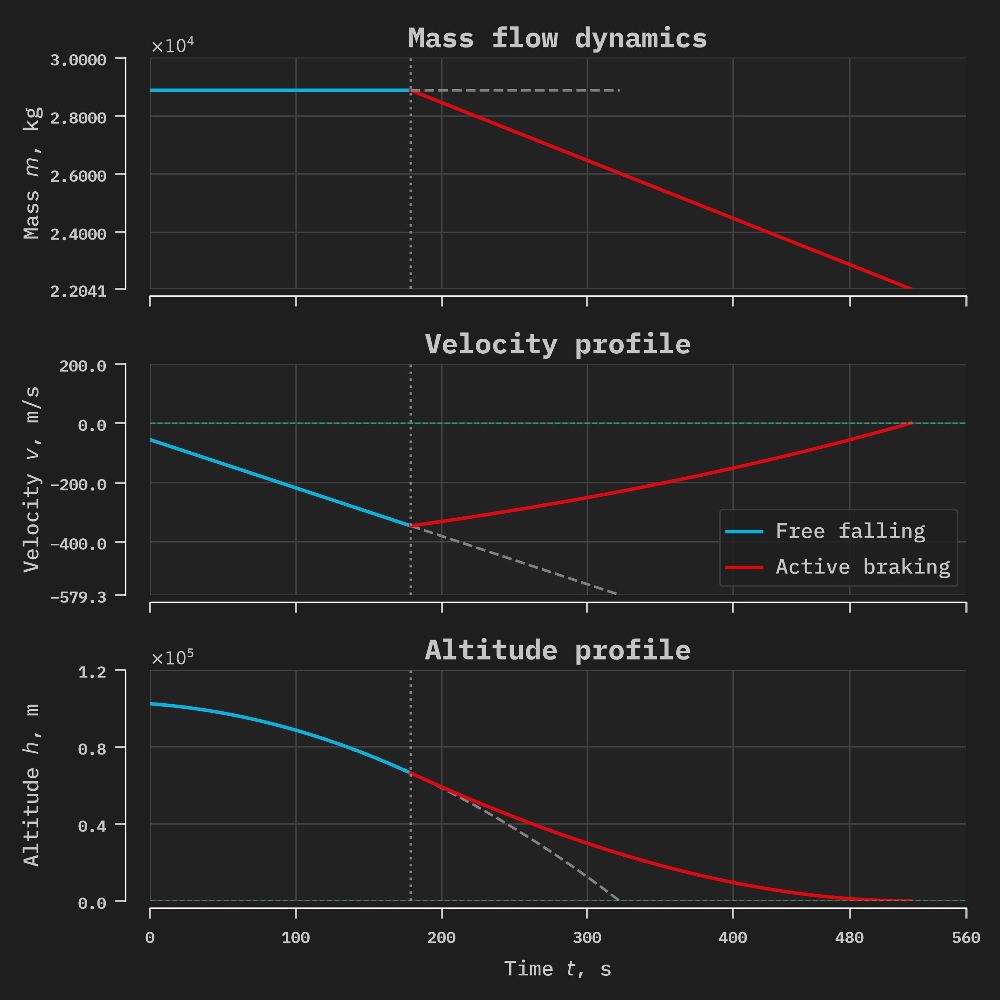
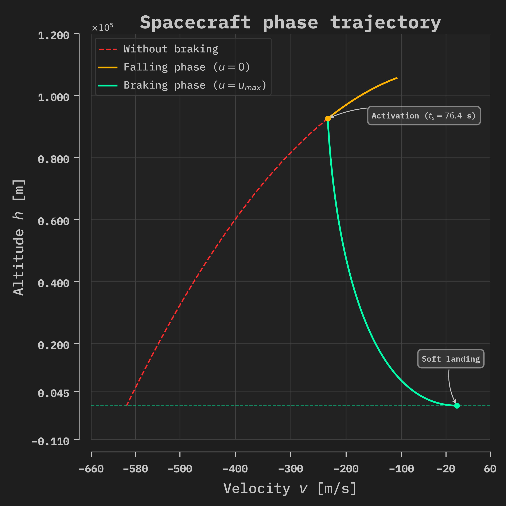
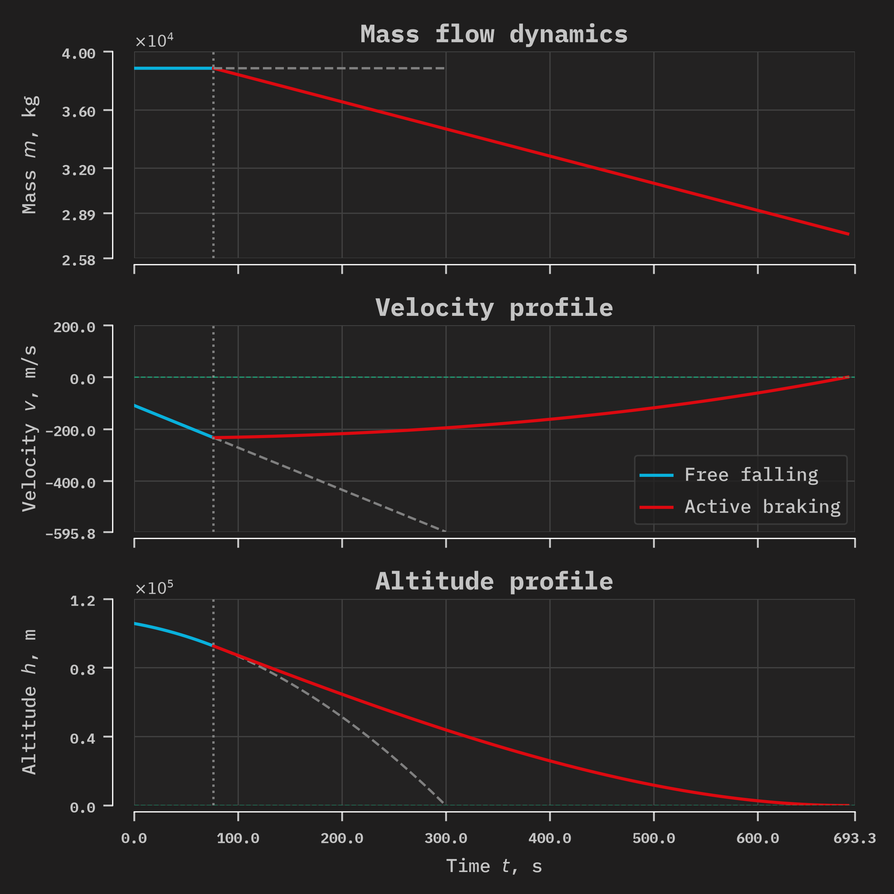
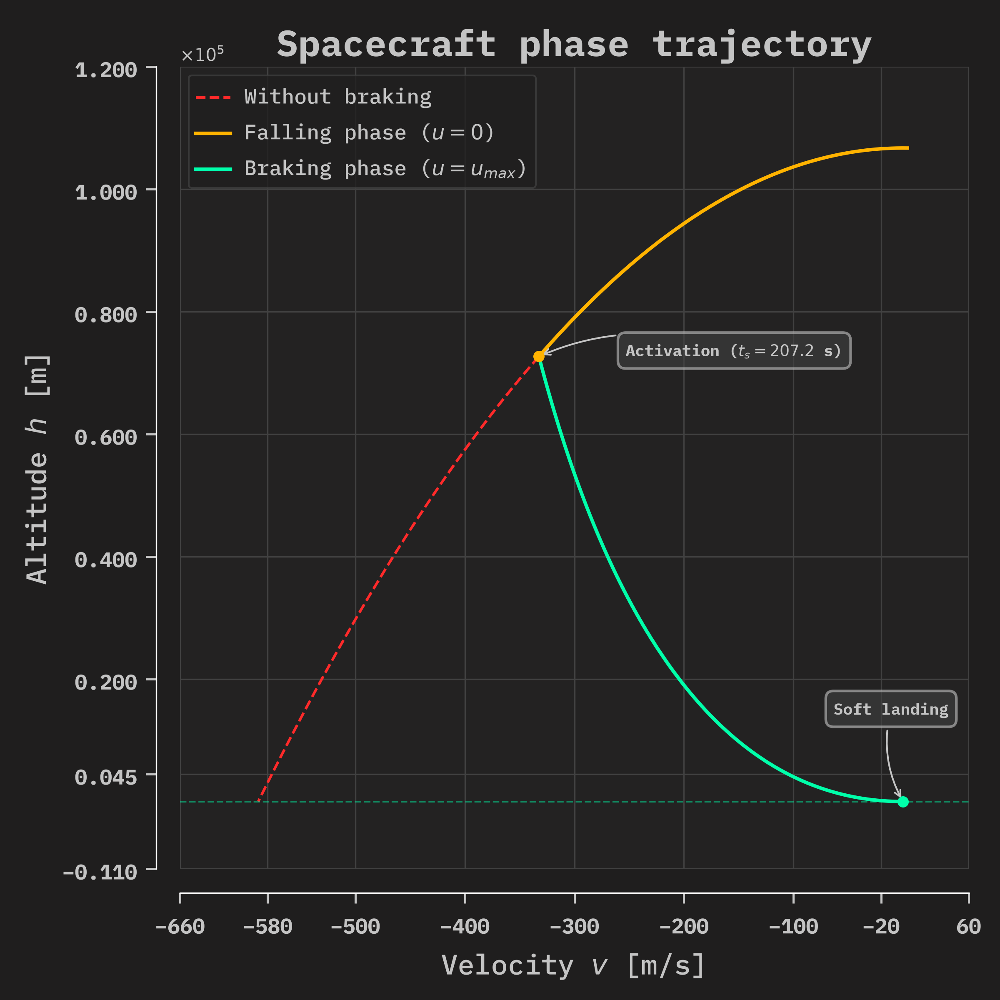
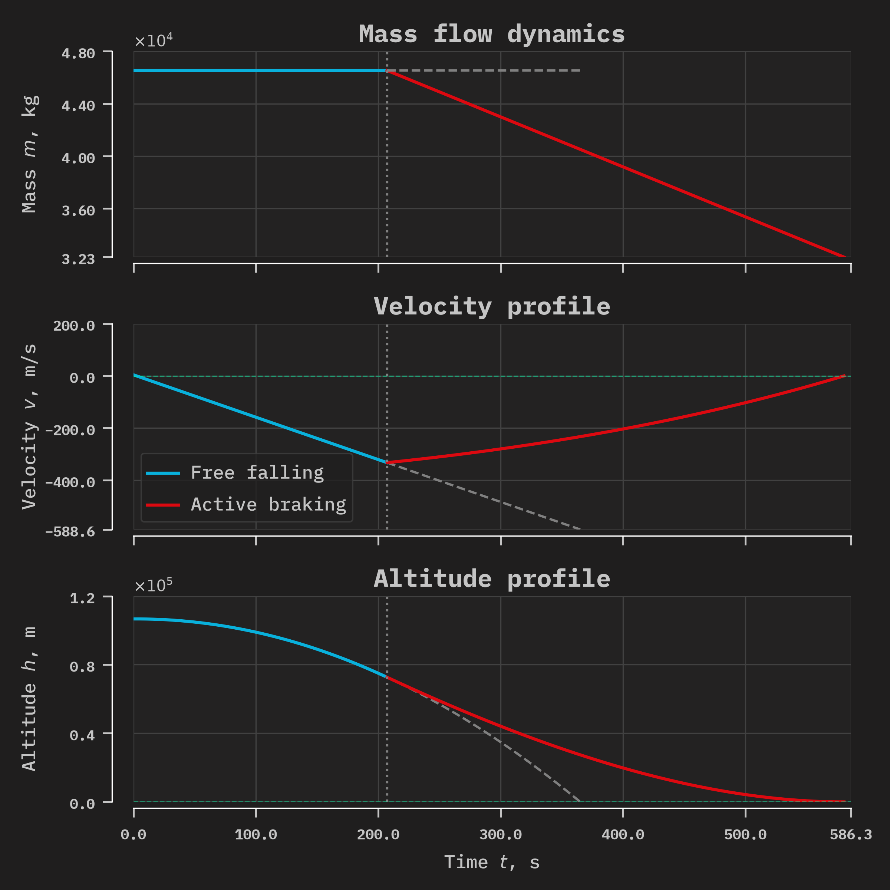
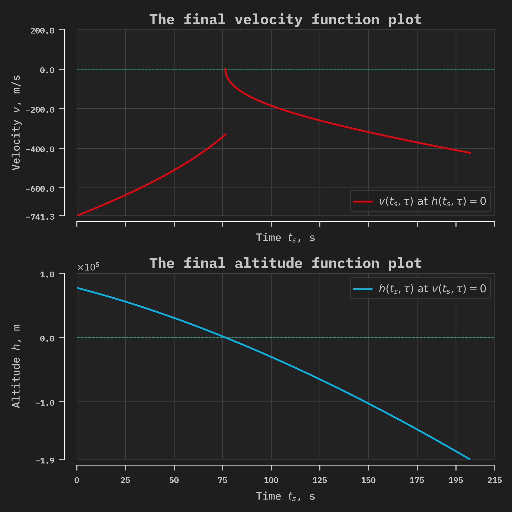
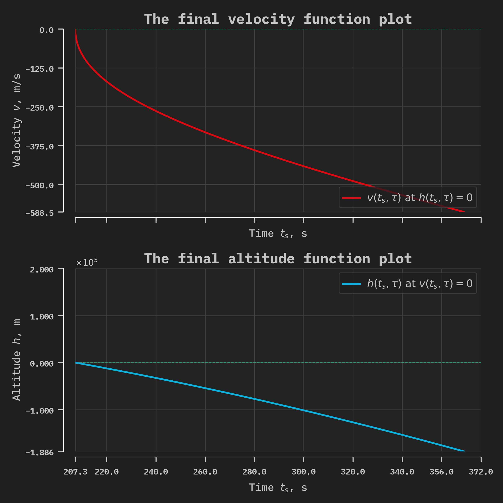

# 📊 Examples of PyAstroPDL Work

## 🚀 Program Output, Plots, and Animations
---

The following solver settings were used to find the solutions:
```python
solver = pdl.Solver(init_cond, end_cond, rocket_params, sim_engine='static_g')
solver.solve(dt=0.01)
solver.find_residuals(dt=0.1)
```

---
### 🔹 Example 1. Standard LLO Descent (TWR ~1.42)

The following system parameters are considered:
```Python
# === Condition of BVP ===

init_cond = [28877, -56, 102378]  # [m_0, v_0, h_0] 

end_cond = [0, 0]                 # [v_tau, h_tau]

# === Rocket Parameters ===     
rocket_params = (66628, 0.00029903701260349804, 17644)  # (u_max, k, m_fuel)

```

#### 📋 Summary of the solution:
```Bash
[ EXECUTING ]: Standard LLO Descent (TWR ~1.42)
[ SUCCESS ]: Solved in 0.0286 seconds.

    =========================================================================
                        LUNAR SOFT LANDING RESULTS                  
    =========================================================================
    Parameter          |  Engine Switching (t_s)  |  Terminal Landing (tau)
    -------------------------------------------------------------------------
    Time (s)           |                  178.87  |                  521.97
    Altitude (m)       |                66390.54  |                    0.00
    Velocity (m/s)     |                 -346.38  |                    0.00
    Vehicle Mass (kg)  |                28877.00  |                22041.01
    =========================================================================
```

#### 📈 Visualizations (Phase Trajectory & Telemetry)





#### 🎬 Trajectory Animation

[🔗 Watch Animation (MP4)](assets/video/st_ani_standard_llo_descent.mp4)

---

### 🔹 Example 2. Heavy Cargo Landing (TWR ~1.04, Critical Mass)

The following system parameters are considered:

```Python
# === Condition of BVP ===

init_cond = [38852, -109, 105674]  # [m_0, v_0, h_0] 

end_cond = [0, 0]                 # [v_tau, h_tau]

# === Rocket Parameters ===     
rocket_params = (65848, 0.0002832545036049801, 15358)  # (u_max, k, m_fuel)

```

#### 📋 Summary of the solution:
```Bash
[ EXECUTING ]: Heavy Cargo Landing (TWR ~1.04, Critical Mass)
[ SUCCESS ]: Solved in 0.0483 seconds.

    =========================================================================
                        LUNAR SOFT LANDING RESULTS                  
    =========================================================================
    Parameter          |  Engine Switching (t_s)  |  Terminal Landing (tau)
    -------------------------------------------------------------------------
    Time (s)           |                   76.42  |                  686.48
    Altitude (m)       |                92603.07  |                   -0.00
    Velocity (m/s)     |                 -233.07  |                    0.00
    Vehicle Mass (kg)  |                38852.00  |                27473.33
    =========================================================================
```

#### 📈 Visualizations (Phase Trajectory & Telemetry)





#### 🎬 Trajectory Animation

[🔗 Watch Animation (MP4)](assets/video/st_ani_heavy_cargo_low_twr.mp4)

---

### Example 3. Orbital Drop (Zero Initial Velocity)

The following system parameters are considered:

```Python
# === Condition of BVP ===

init_cond = [46535, 4, 106691]  # [m_0, v_0, h_0] 

end_cond = [0, 0]                 # [v_tau, h_tau]

# === Rocket Parameters ===     
rocket_params = (98004, 0.0003892046614419574, 27900)  # (u_max, k, m_fuel)

```

#### 📋 Summary of the solution:
```Bash
[ EXECUTING ]: Orbital Drop (Zero Initial Velocity)
[ SUCCESS ]: Solved in 0.0336 seconds.

    =========================================================================
                        LUNAR SOFT LANDING RESULTS                  
    =========================================================================
    Parameter          |  Engine Switching (t_s)  |  Terminal Landing (tau)
    -------------------------------------------------------------------------
    Time (s)           |                  207.21  |                  580.46
    Altitude (m)       |                72667.14  |                   -0.00
    Velocity (m/s)     |                 -332.39  |                    0.00
    Vehicle Mass (kg)  |                46535.00  |                32298.01
    =========================================================================
```

#### 📈 Visualizations (Phase Trajectory & Telemetry)






#### 🎬 Trajectory Animation

[🔗 Watch Animation (MP4)](assets/video/st_ani_orbital_drop.mp4)

---

## 📉 Residual Function Plots
---


### The following solver settings were used to calculate the residual functions:
```Python
solver = pdl.Solver(init_cond, end_cond, rocket_params, sim_engine='static_g')

solver.solve(dt=0.01)

solver.find_residuals(dt=0.1)
```

---

#### Example 1. Standard LLO Descent (TWR ~1.42)

The following system parameters are considered:

```Python
# === Condition of BVP ===

init_cond = [28877, -56, 102378]  # [m_0, v_0, h_0] 

end_cond = [0, 0]                 # [v_tau, h_tau]

# === Rocket Parameters ===     
rocket_params = (66628, 0.00029903701260349804, 17644)  # (u_max, k, m_fuel)

```

#### ⏱️ Calculation execution time:
```Bash
[ EXECUTING ]: Standard LLO Descent (TWR ~1.42)
[ SUCCESS ]: Find in 4.1378 seconds.
```

#### 🖼️ Residual function plot:


---

### 🔹 Example 2. Heavy Cargo Landing (TWR ~1.04, Critical Mass)

The following system parameters are considered:

```Python
# === Condition of BVP ===

init_cond = [38852, -109, 105674]  # [m_0, v_0, h_0] 

end_cond = [0, 0]                 # [v_tau, h_tau]

# === Rocket Parameters ===     
rocket_params = (65848, 0.0002832545036049801, 15358)  # (u_max, k, m_fuel)

```

#### ⏱️ Calculation execution time:
```Bash
[ EXECUTING ]: Heavy Cargo Landing (TWR ~1.04, Critical Mass)
[ SUCCESS ]: Find in 0.9697 seconds.
```

#### 🖼️ Residual function plot:



---

### 🔹 Example 3. Orbital Drop (Zero Initial Velocity)

The following system parameters are considered:
```Python
# === Condition of BVP ===

init_cond = [46535, 4, 106691]  # [m_0, v_0, h_0] 

end_cond = [0, 0]                 # [v_tau, h_tau]

# === Rocket Parameters ===     
rocket_params = (98004, 0.0003892046614419574, 27900)  # (u_max, k, m_fuel)


```

#### ⏱️ Calculation execution time:
```Bash
[ EXECUTING ]: Orbital Drop (Zero Initial Velocity)
[ SUCCESS ]: Find in 20.1257 seconds.
```

#### 🖼️ Residual function plot:



---