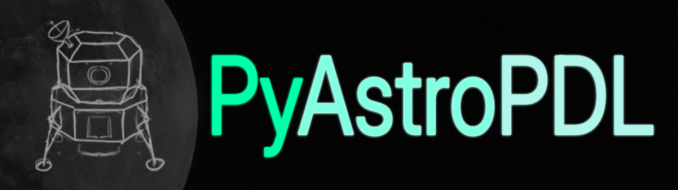

<p align="center">
  
</p>

# PyAstroPDL: Powered Descent and Landing Solver v0.9.0 (Lunar Edition)

**PyAstroPDL**  is a high-performance Python package for solving 1D lunar soft-landing optimal control problems.
The package is designed with a modular architecture using JIT compilation (Numba) and contains an advanced toolkit for visualizing phase trajectories and telemetry.

---
## 📐 Mathematical Core & Numerical Methods

The structure of the optimal control is derived via Pontryagin’s maximum principle.

The package’s mathematical core is based on three numerical methods:

1. **Shooting Method:** Used to reduce a complex BVP to a root-finding problem for a residual function by integrating an initial value problem at each iteration (shot) and adjusting a free parameter of the system (shooting parameter).

2. **Fourth-Order Runge-Kutta (RK4):** Used for numerical integration of the system of differential equations.

3. **Halley's Method:**  Used to approximate roots with cubic convergence.

---
## 🏗️ Architecture & Package Structure

The package is divided into two modules:

* **`pyastropdl.core`** — Computational module. It contains the implementation of the theoretical part of the algorithm for solving the 1D lunar soft-landing optimal control problem.
  
   * **`Solver`** — A class for finding a solution based on the obtained system parameters and for calculating the residual functions.
  
* **`pyastropdl.visualization`** — Visualization module. It contains tools needed to graphically display the solution and the residual functions.

   * **`Plotter`** — A class for displaying telemetry, phase trajectories, and residual plots.
  
   * **`Animator`** — A class for generating an animation of the phase trajectory.
  
---
## ⚙️ The Solver Class and Its Methods

* **`Solver(init_cond, end_cond, rocket_params, sim_engine)`** is a class for solving 1D lunar soft-landing problems. It takes boundary conditions, rocket parameters, and the simulation engine type as input: `init_cond` = $[m_0, v_0, h_0]$, `end_cond` = $[v(\tau), h(\tau)]$, `rocket_params` = $(u_{\max}, k, m_{\text{propellant}})$, `sim_engine` = `"static_g"` or `"dynamic_g"`.  
  
  * **`.solve(dt, eps)`** is a method for finding the solution to the BVP. It takes `dt` (simulation step) and `eps` (tolerance for root localization of the residual function). It returns an array of the spacecraft’s phase states corresponding to the found solution. 
  
  * **`.print_results()`** is a method for printing a concise report on the spacecraft’s state at optimal engine ignition ($t_s$) and at the terminal time $\tau$.
  
  * **`.find_residuals(dt)`** is a method for calculating values of the residual functions. It takes `dt` (simulation step). It returns a tuple of two arrays: residual function values for terminal altitude and velocity, respectively.
  
---
## ⚙️ The Simulation Engines

The Solver class supports switching between gravity models via the `sim_engine` parameter:

* **`static_g`** (Default) – Uses a static gravitational acceleration above the lunar surface $g = 1.6234 \text{ m/s}^2$.
  
* **`dynamic_g` [EXPERIMENTAL]** — Calculates gravitational acceleration dynamically depending on the spacecraft’s altitude.
  
  > **⚠️ Warning:** The `dynamic_g` engine is currently in experimental mode. The calculation of $\Delta v$ is performed using a simplified formula for static gravitation. There may be unstable behavior of the algorithm for localizing the bounds $[t_{\min}, t_{\max}]$, which can lead to a failure to find a solution even if it exists.

---
## ⚙️ The Plotter Class and Its Methods

* **`Plotter(solver)`** is a class for static visualization. It requires a Solver instance for initialization from which it automatically extracts the required data.
  
  * **`.plot_trajectory(fname)`** is a method for displaying the spacecraft’s phase trajectory plot. It takes `fname` (save path). It saves the image relative to the current working directory. The default filename is `phase_trajectory.png`.
  
  * **`.plot_telemetry(fname)`** is a method for displaying the spacecraft’s time-series telemetry. It takes `fname` (save path). It saves the image relative to the current working directory. The default filename is `telemetry.png`.
  
  * **`.plot_residuals(fname)`** is a method for displaying the residual function plots. It takes `fname` (save path). It saves the image relative to the current working directory. The default filename is `residuals.png`.

---
## ⚙️ The Animator Class and Its Method

* **`Animator(solver)`** is a class for dynamic visualization. It requires a Solver instance for initialization from which it automatically extracts the required data.
  
  * **`.animate(fps, duration, fname)`** is a method for generating an animation of the spacecraft’s phase trajectory. It takes `fps` (frame rate), `duration` (in seconds), `fname` (save path). It saves the video file relative to the current working directory. The default filename is `trajectory.mp4`. 
  
---

## 🚀 Quickstart

Install the package via pip:

```bash
pip install pyastropdl
```

```python
import pyastropdl as pdl

# === Condition of BVP ===
h_0 = 35000        # Initial altitude (m)
v_0 = 125          # Initial velocity (m/s)
m_0 = 750          # Initial mass of the spacecraft with the fuel (kg)

init_cond = [m_0, v_0, h_0]  

h_tau = 0          # Condition on altitude for soft landing (m)
v_tau = 0          # Condition on velocity for soft landing (m/s)

end_cond = [v_tau, h_tau]

# === Rocket Parameters (DPS Engine) ===     
u_max = 1700.0      # Max thrust (N)
isp = 311.0         # Specific impulse (s)
g_earth = 9.80665   # Standard Earth gravity constant (m/s^2)

# Mass flow rate coefficient k = 1 / (Isp * g_0)
k = 1.0 / (isp * g_earth)

m_propellant = 190  # Mass of propellant (kg)

rocket_params = (u_max, k, m_propellant)

# Initialisation of Solver
solver = pdl.Solver(init_cond, end_cond, rocket_params, sim_engine='static_g')

# Solve the system and print short results
solver.solve(dt=0.1)
solver.print_results()

# Find the residuals functions
solver.find_residuals(dt=0.1)

# Initialisation of Plotter
plotter = pdl.Plotter(solver)

# Plot the graphs of the spacecraft phase trajectory and telemetry 
plotter.plot_trajectory()
plotter.plot_telemetry()

# Plot the residuals functions
plotter.plot_residuals()

# Initialisation of Animator
animator = pdl.Animator(solver)

# Animate the spacecraft trajectory
animator.animate(fps=60, duration=15)
```

---
## 📊 Examples
Examples of the program output are available in the [Examples (static g).md](.github/Examples%20(static%20g).md) or [Examples (dynamic g).md](.github/Examples%20(dynamic%20g).md) file.

---
## 📂 Repository Structure
```text
pyastropdl/
├── pyastropdl/                  # Main Package Directory
│   ├── core/                    # Computational module
│   │   ├── common/              
│   │   ├── simulation_engine/   # Numerical integration & gravity models
│   │   ├── solvers/             # BVP shooting algorithm implementation
│   │   ├── utils/               # Helper functions, paths & type definitions
│   │   └── solver.py            # Main Solver API entry point
│   │
│   └── visualization/           # Visualization module
│       ├── style/               # Visual presets (colors, fonts, themes)
│       ├── components/          # Components for vsisualization
│       ├── animator.py          # Dynamic MP4 phase portrait rendering
│       └── plotter.py           # Static telemetry charts generation
│
├── Paper/                       # Theoretical derivation documents
├── pyproject.toml               # Package build configuration
└── README.md
```

---

## 🎓 Academic Background & Project Evolution
This project evolved from an initial short paper into an independent Python package and a full paper. 

### 📜 Short Paper (ITEST-2026)
The initial mathematical problem formulation was published in the conference proceedings:

> **"DETERMINING THE SWITCHING AND LANDING TIME IN THE MOON SOFT LANDING PROBLEM" (p. 396.)**  
> [*Conference proceedings of the VIII International Scientific-Practical Conference "Information Technology for Education, Science and Technics" (ITEST-2026)*](https://zenodo.org/records/21493752)

* **Theoretical development of the algorithm and code:** Tymoshchuk Dmytro (`@angelet_dev`)
* **Scientific supervision and organizational support:** Revina Tetiana 
### 📑 The Full Paper and Python Package
This repository contains a paper (in the `Paper/` directory) accompanying the **PyAstroPDL** codebase.

---
## 👤 Author

* **Tymoshchuk Dmytro** (`@angelet_dev`) — Sole developer of the **PyAstroPDL** package and author of the accompanying paper.
  
---
## 🛠 Tech Stack
*   **Core:** Python 3
*   **Computation Engine:** NumPy, Numba (JIT).
*   **Graphics:** Matplotlib.
  
---
## 📜 License
Distributed under the MIT License. See `LICENSE` for more information.


